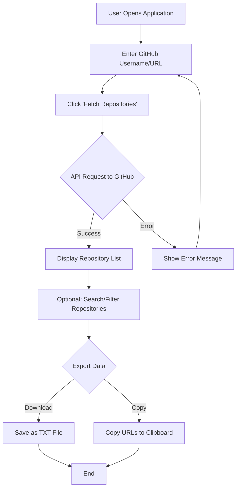
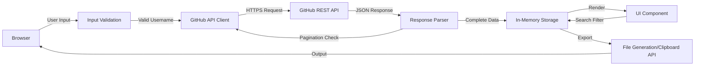

# xsukax GitHub Repository Fetcher

[](https://xsukax.github.io/xsukax-GitHub-Repository-Fetcher)
[](https://www.gnu.org/licenses/gpl-3.0)
[](https://github.com/xsukax/xsukax-GitHub-Repository-Fetcher)

A lightweight, privacy-focused web application that enables developers and researchers to efficiently retrieve and export all repository URLs from any GitHub user or organization profile. Built with vanilla JavaScript and designed to run entirely in the browser without requiring backend infrastructure or user authentication.

**[🚀 Try Live Demo](https://xsukax.github.io/xsukax-GitHub-Repository-Fetcher)**

---

## 📋 Project Overview

The **xsukax GitHub Repository Fetcher** is a client-side web application that interfaces directly with the GitHub REST API to enumerate and extract repository URLs from public GitHub profiles. The tool accepts either a GitHub username or a complete profile URL as input, fetches up to 1,000 repositories (automatically handling pagination), and presents them in an intuitive, searchable interface. Users can export the complete list of repository URLs as a plain text file or copy them directly to the clipboard for integration into other workflows.

This application is particularly valuable for developers conducting code audits, researchers analyzing open-source ecosystems, DevOps engineers managing repository collections, and anyone needing systematic access to a user's or organization's complete GitHub repository portfolio.

---

## 🔒 Security and Privacy Benefits

This application prioritizes user privacy and security through its architectural design and implementation choices:

### Client-Side Architecture
- **Zero Server Communication**: All processing occurs entirely within the user's browser. No data is transmitted to third-party servers, eliminating potential intermediary data collection or interception points.
- **No Backend Infrastructure**: The application operates as a static HTML page, removing attack surfaces associated with server-side code execution, database vulnerabilities, or server misconfigurations.

### Data Protection
- **No Data Persistence**: The application does not use localStorage, sessionStorage, cookies, or any form of persistent storage. All fetched data exists only in memory during the active session and is immediately discarded when the browser tab is closed.
- **No Authentication Required**: Users interact with the GitHub API anonymously without providing credentials, API keys, or personal access tokens, minimizing exposure of sensitive authentication data.
- **Direct API Communication**: Requests are made directly from the user's browser to GitHub's official API endpoints, ensuring that no intermediary services can log, monitor, or tamper with the data exchange.

### Transparency and Trust
- **Open Source**: The complete source code is publicly available for audit and review, allowing security researchers and developers to verify the absence of malicious code, tracking mechanisms, or data exfiltration attempts.
- **No External Dependencies**: Beyond Font Awesome for icons (loaded from CDN), the application relies solely on native browser APIs and vanilla JavaScript, reducing the risk of supply chain attacks through compromised third-party libraries.
- **No Analytics or Tracking**: The application contains no embedded analytics scripts, tracking pixels, or telemetry collection mechanisms.

### Rate Limiting Transparency
The application respects GitHub's API rate limits and provides clear error messages when limits are exceeded, promoting responsible API usage and preventing abuse scenarios that could impact GitHub's infrastructure or other users.

---

## ✨ Features and Advantages

### Core Functionality
- **Flexible Input Methods**: Accepts GitHub usernames (`torvalds`), partial URLs (`github.com/microsoft`), or complete profile URLs (`https://github.com/facebook`)
- **Comprehensive Repository Retrieval**: Automatically fetches up to 1,000 repositories using intelligent pagination, covering the vast majority of user and organization profiles
- **Real-Time Search and Filtering**: Instant client-side search functionality allows filtering repositories by name or URL without additional API calls
- **Dual Export Options**: Download repository lists as formatted `.txt` files or copy directly to clipboard for seamless integration with scripts and automation tools

### User Experience
- **Intuitive Interface**: Clean, GitHub-inspired dark theme with responsive design that adapts seamlessly to desktop and mobile devices
- **Progress Feedback**: Visual loading indicators and status messages keep users informed during data retrieval operations
- **Keyboard Navigation**: Full support for keyboard shortcuts, including Enter key submission for accessibility and efficiency
- **Error Handling**: Comprehensive error messages for common scenarios including invalid usernames, API rate limits, and network failures

### Technical Advantages
- **Zero Configuration**: No installation, compilation, or build process required—simply open the HTML file in any modern browser
- **Cross-Platform Compatibility**: Works identically on Windows, macOS, Linux, and mobile operating systems through any standards-compliant web browser
- **Minimal Resource Footprint**: Single HTML file under 15KB requires no runtime dependencies, databases, or server processes
- **Offline Capable**: After initial load, the application can be saved locally and used without internet connectivity for previously fetched data review

### Performance
- **Parallel Request Processing**: Utilizes asynchronous pagination to fetch multiple pages simultaneously, significantly reducing total retrieval time for users with large repository counts
- **Efficient Rendering**: Virtual scrolling-ready architecture handles large repository lists without UI degradation or memory bloat

---

## 🚀 Installation Instructions

### Prerequisites
- A modern web browser (Chrome 90+, Firefox 88+, Safari 14+, Edge 90+, or equivalent)
- Internet connection for accessing GitHub API and Font Awesome CDN
- **No server-side requirements** (PHP, Node.js, Python, etc. are not needed)

### Installation Methods

#### Method 1: Direct Browser Access (Recommended for Testing)
1. Visit the live demo: [https://xsukax.github.io/xsukax-GitHub-Repository-Fetcher](https://xsukax.github.io/xsukax-GitHub-Repository-Fetcher)
2. Bookmark the page for future access
3. No installation required

#### Method 2: Local Deployment
1. Clone the repository:
   ```bash
   git clone https://github.com/xsukax/xsukax-GitHub-Repository-Fetcher.git
   cd xsukax-GitHub-Repository-Fetcher
   ```

2. Open `index.html` in your web browser:
   - **Double-click** the file in your file explorer, or
   - **Right-click** → "Open with" → Select your preferred browser, or
   - **Drag and drop** the file into an open browser window

#### Method 3: Web Server Hosting (Optional)
For hosting on a web server (Apache, Nginx, GitHub Pages, etc.):

1. Upload `index.html` to your web server's document root
2. Access via your domain: `https://yourdomain.com/index.html`

**Note**: No web server configuration is required. Standard static file serving is sufficient.

#### No php.ini Configuration Required
This is a pure client-side application built with HTML, CSS, and JavaScript. It does not use PHP or any server-side scripting language, therefore **no php.ini configuration or PHP installation is necessary**.

---

## 📖 Usage Guide

### Basic Workflow



### Step-by-Step Instructions

#### 1. Accessing the Application
Navigate to the live demo or open your local `index.html` file in a web browser.

#### 2. Entering Target Information
In the input field, enter one of the following:
- **GitHub Username**: `torvalds`, `microsoft`, `facebook`
- **Partial URL**: `github.com/octocat`
- **Complete URL**: `https://github.com/nodejs/node`

#### 3. Fetching Repositories
- Click the **"Fetch Repositories"** button or press **Enter**
- The application will display a loading indicator while communicating with GitHub's API
- Progress messages will inform you of the retrieval status

#### 4. Reviewing Results
- Repositories are displayed in a scrollable list sorted by last update
- Each entry shows:
  - Repository icon
  - Repository name
  - Complete GitHub URL
  - Numerical index
- Click any repository to open it in a new browser tab

#### 5. Searching and Filtering
Use the search bar above the repository list to filter results in real-time by:
- Repository name
- Repository URL components

The counter updates dynamically to show filtered vs. total repository counts.

#### 6. Exporting Data

**Download as Text File:**
- Click **"Download URLs as TXT"**
- A file named `{username}_repositories.txt` will be saved to your default downloads folder
- Each line contains one repository URL

**Copy to Clipboard:**
- Click **"Copy All URLs"**
- All repository URLs are copied as newline-separated text
- Paste directly into text editors, terminals, or scripts

### Application Architecture



### API Rate Limiting

The GitHub API imposes rate limits on unauthenticated requests:
- **60 requests per hour** per IP address for unauthenticated access
- Each user profile with ≤100 repositories consumes 1 request
- Each user profile with 101-1000 repositories consumes 2-10 requests (due to pagination)

If you encounter rate limit errors:
1. Wait for the rate limit window to reset (typically 1 hour from first request)
2. Consider using authenticated API access for higher limits (requires code modification)
3. Check your current rate limit status at: https://api.github.com/rate_limit

### Troubleshooting Common Issues

| Issue | Cause | Solution |
|-------|-------|----------|
| "User not found" | Invalid username or private profile | Verify username spelling and ensure profile is public |
| "API rate limit exceeded" | Too many requests within 1 hour | Wait 1 hour or implement authenticated API access |
| "No repositories found" | User has no public repositories | Confirm the user has public repositories on their profile |
| Search not working | Browser compatibility | Use a modern browser version (see prerequisites) |

---

## 📄 Licensing Information

This project is licensed under the GNU General Public License v3.0, ensuring that the software remains free and open-source for all users while requiring derivative works to maintain the same freedoms.

---

## 🤝 Contributing

Contributions are welcome! Please feel free to submit pull requests or open issues for bugs, feature requests, or documentation improvements.

### Development Guidelines
- Maintain client-side only architecture (no server-side dependencies)
- Preserve privacy-focused design principles
- Ensure cross-browser compatibility
- Follow existing code style and conventions
- Update documentation for new features

---

## 🔗 Links

- **Live Demo**: [https://xsukax.github.io/xsukax-GitHub-Repository-Fetcher](https://xsukax.github.io/xsukax-GitHub-Repository-Fetcher)
- **Repository**: [https://github.com/xsukax/xsukax-GitHub-Repository-Fetcher](https://github.com/xsukax/xsukax-GitHub-Repository-Fetcher)
- **GitHub API Documentation**: [https://docs.github.com/en/rest](https://docs.github.com/en/rest)
- **Report Issues**: [https://github.com/xsukax/xsukax-GitHub-Repository-Fetcher/issues](https://github.com/xsukax/xsukax-GitHub-Repository-Fetcher/issues)

---

## ⭐ Support

If you find this tool useful, please consider:
- ⭐ Starring the repository on GitHub
- 🐛 Reporting bugs or suggesting features via GitHub Issues
- 🔀 Contributing improvements through pull requests
- 📢 Sharing the tool with other developers

---

**Created with ❤️ for the open-source community**
